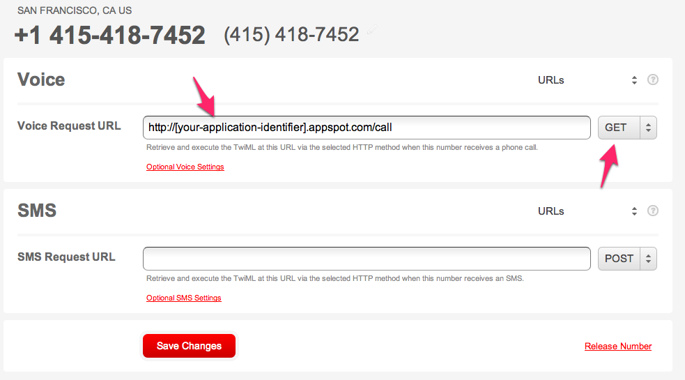

# Trigger a PagerDuty incident from a phone call

This is not an officially supported PagerDuty product, and not covered by our SLA.  But I do work for PagerDuty, so feel free to [email me](mailto:dave@pagerduty.com) about it.

# Requirements

1. Set up a [PagerDuty account](http://www.pagerduty.com/pricing) if you don't already have one, and create a Generic API service.  We'll use the Service API key.
2. You'll need to set up a Google App Engine account, and create an application.  We'll use the application identifier.
3. Change the "application: pdtestthrough" line in app.yaml to your application identifier, and the SERVICE_KEY = "6f4d18600a9b012f6a9722000a9040cf" line in main.py to your service API key
4. Deploy to [Google App Engine](https://appengine.google.com)
5. Create a [Twilio](http://twilio.com) account, and set up an incoming phone number to point to http://[your-application-identifier].appspot.com/call
6. Call that number and leave a message.

# Walkthrough

